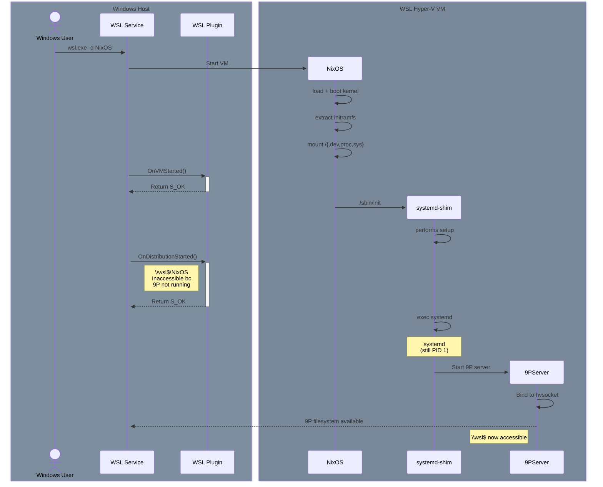
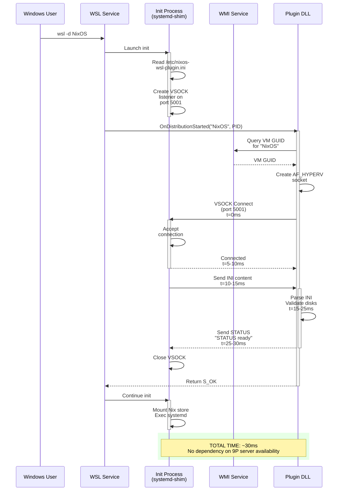
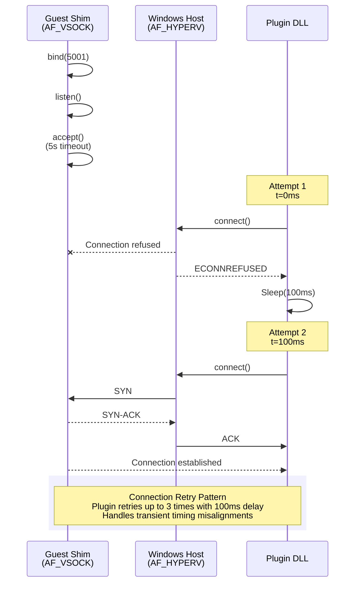
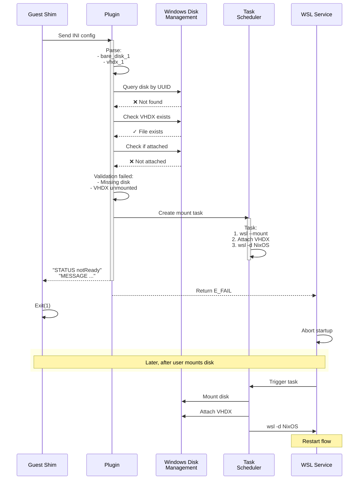
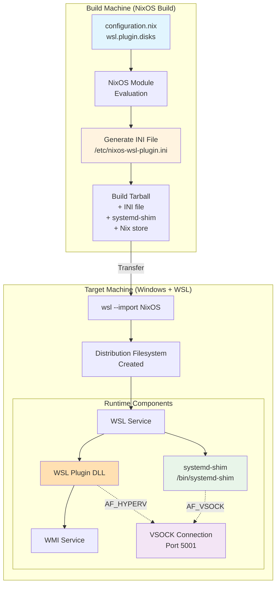
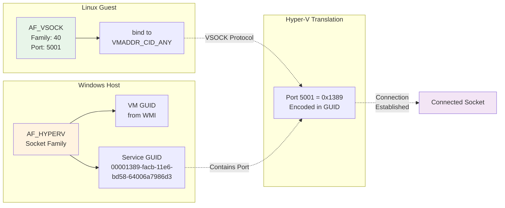
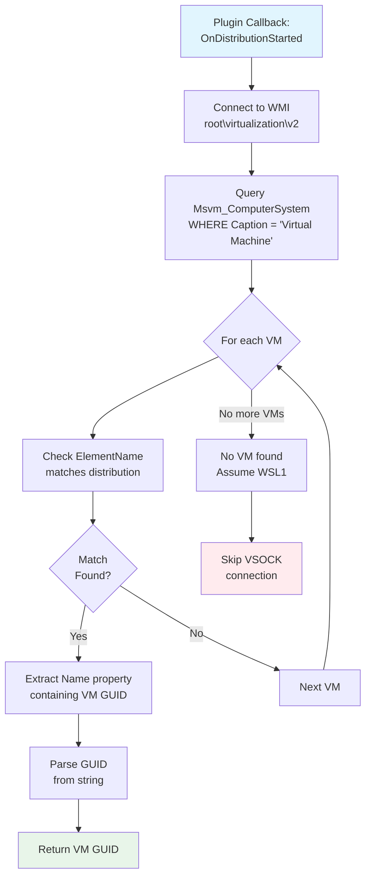
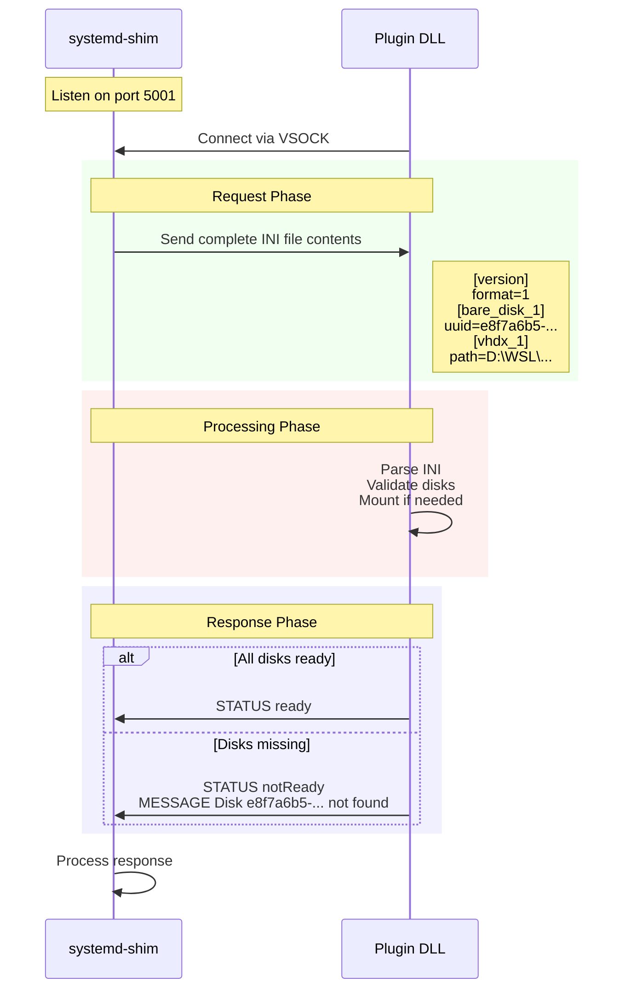
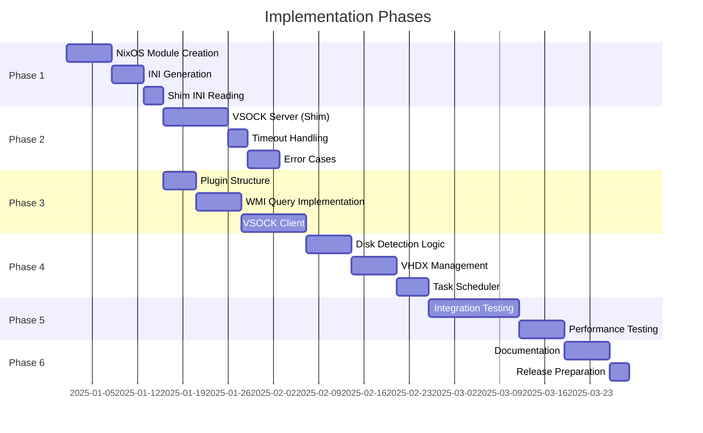

# WSL Plugin + NixOS-WSL Systemd-Shim IPC Design (Revised)

## Executive Summary

This document presents the complete design for WSL plugin integration with NixOS-WSL, enabling declarative disk management through NixOS configuration. After comprehensive research into WSL architecture and timing constraints, this design uses VSOCK-based communication between the plugin and the systemd-shim, with careful attention to initialization timing and race conditions.

**Key Architectural Decisions:**
- IPC mechanism: VSOCK communication with shim as server, plugin as client
- Configuration format: Windows INI format (native Windows API support, zero dependencies for C++)
- Configuration location: `/etc/nixos-wsl-plugin.ini` in distribution filesystem
- Timing approach: Plugin connects to shim-hosted VSOCK server after init launch
- VM identification: WMI queries through Hyper-V management interface

**Critical Finding:** The 9P file server that enables `\\wsl$\` filesystem access is a Linux-side process started by the init process during initialization. Since the `OnDistributionStarted` callback occurs immediately when the init process starts (not after initialization completes), the 9P server is not yet available when the plugin callback executes. This creates a race condition that makes direct filesystem access unreliable. VSOCK communication avoids this timing dependency.

---

## Use Case

Building a WSL plugin for NixOS-WSL that accomplishes the following objectives:
1. Ensures specified bare disks are mounted by UUID before distribution boots
2. Creates and attaches secondary VHDX files as needed
3. All requirements derive from NixOS declarative configuration
4. Distribution cannot proceed until Windows-side requirements are met
5. Plugin selectively activates only for distributions that implement the protocol

---

## Sequence Timing Diagrams

### Diagram 1: Why WSL Plugin Cannot Directly Access VM Rootfs

Because:
- Filesystem interop is provided by the 9p server
- 9P server runs as systemd service in the VM
- NixOS-WSL declares `systemd-shim` as its "init" process (PID=1) to WSL
- `systemd-shim` ensures NixOS-WSL distro requirements are met, then `exec systemd`
- Plugin-`systemd-shim` interaction must complete before `systemd-shim` execs systemd
- _**9P (nor any) systemd service cannot exist during `systemd-shim`'s lifetime**_



### Diagram 2: VSOCK-Based Solution (Successful Connection)



### Diagram 3: VSOCK Connection Retry Logic



### Diagram 4: Disk Validation and Task Scheduler Fallback



### Diagram 5: Distribution Detection Through VSOCK Connection

```mermaid
sequenceDiagram
    participant U as Ubuntu Dist<br/>(No VSOCK srv)
    participant N as NixOS Dist<br/>(VSOCK server)
    participant P as Plugin DLL

    Note over N: Read INI config
    N->>N: bind(5001)<br/>listen()
    
    rect rgb(255, 240, 240)
        Note over P: OnDistributionStarted("Ubuntu")
        
        loop Connection Attempts
            P->>U: connect()<br/>Attempt 1-3
            U-->>P: ECONNREFUSED<br/>No listener
            P->>P: Sleep(100ms)
        end
        
        P->>P: All attempts failed<br/>Return S_OK<br/>(Skip Ubuntu)
    end
    
    rect rgb(240, 255, 240)
        Note over P: OnDistributionStarted("NixOS")
        
        P->>N: connect()<br/>Attempt 1
        N->>N: Accept connection
        N-->>P: SUCCESS
        
        N<->P: Protocol exchange
        P->>P: Process<br/>requirements
    end
    
    rect rgb(240, 240, 255)
        Note over U,P: Selective Activation Pattern<br/>Plugin only processes distributions with VSOCK listener<br/>Connection attempt serves as detection
    end
```

---

## System Architecture Overview



---

## Critical Research Finding: The 9P Server Timing Issue

### What is the 9P Server

Based on official WSL technical documentation, the 9P (Plan 9) file server is a Linux-side process that enables Windows to access the distribution filesystem through the `\\wsl$\` path. Key characteristics:

**Location:** The 9P server (named `plan9`) is a Linux process that runs inside each WSL distribution, not on the Windows host.

**Startup:** The 9P server is created and started by the init process during its initialization sequence. From WSL documentation: "Plan9 is a linux process that hosts a plan9 filesystem server for WSL1 and WSL2 distributions. It's created by init in each distribution."

**Communication:** In WSL2, the plan9 process serves the filesystem through an hvsocket, which Windows connects to via the p9rdr.sys driver when accessing `\\wsl$\<distro>\` paths.

### The Race Condition

The timing sequence creates a fundamental race condition as illustrated in Diagram 1. The plugin callback executes when init starts, but filesystem access requires the 9P server to be running, which happens 5-50ms later during init's initialization sequence. This non-deterministic timing makes direct filesystem access unreliable for determining whether to activate the plugin.

**Why this matters for NixOS-WSL:** The NixOS-WSL systemd-shim serves as the init process. It must mount the Nix store and perform other setup before executing systemd. The 9P server startup timing within this sequence is not guaranteed, making it unreliable to assume `\\wsl$\` access is available during the plugin callback.

### Why Direct Filesystem Access Does Not Work

Attempting to read `/etc/nixos-wsl-plugin.ini` via `\\wsl$\NixOS\etc\nixos-wsl-plugin.ini` from the plugin callback would encounter a race condition:

- If the 9P server has started: File access succeeds
- If the 9P server has not started: File access fails with path not found or connection errors
- The outcome is non-deterministic and depends on initialization timing

This unreliability makes direct filesystem access unsuitable for a production system where the plugin must reliably determine whether to activate.

---

## Solution: VSOCK-Based Communication

### Architecture Overview

VSOCK (Virtual Socket) communication provides a timing-independent mechanism for the plugin to communicate with the distribution, as shown in Diagram 2. The architecture uses a server-client reversal pattern that elegantly solves both the timing problem and the selectivity requirement.

**Distribution (systemd-shim) acts as VSOCK server:**
- When the shim starts and determines it has disk requirements, it creates a VSOCK listener on port 5001
- The shim binds to VMADDR_CID_ANY (accepts connections from the host)
- The shim listens for a connection with a timeout

**Plugin acts as VSOCK client:**
- When `OnDistributionStarted` is called, the plugin attempts to connect to the guest on port 5001
- Connection success indicates the distribution supports the protocol
- Connection failure indicates the distribution does not support the protocol
- The connection attempt itself serves as the detection mechanism

### VSOCK Addressing: Linux and Windows Interoperation



**Service GUID Port Encoding:**
The Service GUID follows a specific template format where the first segment encodes the port number:
```
XXXXXXXX-facb-11e6-bd58-64006a7986d3
```
Where `XXXXXXXX` is the port number in hexadecimal. For port 5001:
- 5001 decimal = 0x1389 hexadecimal
- Service GUID = `00001389-facb-11e6-bd58-64006a7986d3`

This encoding is documented in the Hyper-V socket template GUID `HV_GUID_VSOCK_TEMPLATE` defined in Windows SDK headers.

### Why This Architecture Works

**Timing independence:** The plugin does not rely on any Windows-side infrastructure (like the 9P server) being available. It simply attempts a VSOCK connection, which either succeeds or fails based on whether the guest is listening.

**Explicit synchronization:** The shim explicitly signals its readiness by listening on the socket. There is no ambiguity about whether the distribution supports the protocol.

**Selectivity:** Distributions that do not implement the VSOCK server will not be listening on port 5001. The connection attempt will fail immediately, and the plugin will skip that distribution without delay, as shown in Diagram 5.

**No race condition:** Unlike filesystem access which depends on the 9P server starting, VSOCK communication depends only on the kernel's VSOCK support, which is available as soon as the distribution starts.

---

## Configuration Format: Windows INI

### Rationale

The configuration data must be exchanged between the NixOS build system (generates the file), the systemd-shim (reads it to determine disk requirements), and the WSL plugin (receives it via VSOCK). The Windows INI format was selected for the following reasons:

**Native Windows API support:** Windows provides `GetPrivateProfileString` and `GetPrivateProfileInt` functions in kernel32.dll. The C++ plugin can parse INI files with zero external dependencies and zero additional binary size.

**Human-readable:** The INI format is text-based and easily inspectable for debugging. Users can examine `/etc/nixos-wsl-plugin.ini` to verify their configuration.

**Structured and extensible:** The section-based format naturally represents disk configurations. New disk types or parameters can be added as new sections or keys without breaking compatibility.

**Minimal dependencies:** For Rust, the rust-ini crate adds minimal overhead for the shim binary.

### Configuration File Location

The configuration file resides at `/etc/nixos-wsl-plugin.ini` in the distribution's root filesystem. This location is appropriate for several reasons:

**Available Before Nix Store Mount:** The systemd-shim is located at `/bin/systemd-shim` and executes before the Nix store is mounted. The `/etc` directory contains files that exist in the base filesystem and are accessible immediately when the shim starts.

**Precedent in NixOS-WSL:** NixOS-WSL already includes user-editable files in `/etc` that are not managed through the Nix store, such as `/etc/nix/nix.conf` and related configuration files.

**Build-Time Generation:** The INI file is generated during the NixOS build process and included in the tarball that creates the distribution filesystem. It exists as a plain file outside of Nix store management.

**Lifecycle Appropriate:** The plugin configuration is only needed during the early boot phase before systemd takes over. Once the shim executes systemd, this configuration is no longer referenced.

### Format Specification

```ini
[version]
format=1

[bare_disk_1]
uuid=e8f7a6b5-c4d3-a2b1-0123-456789abcdef
label=data-disk

[bare_disk_2]
uuid=f9c8b7a6-d5e4-b3a2-1234-56789abcdef0
label=backup-disk

[vhdx_1]
path=D:\WSL\NixOS\secondary.vhdx
size_gb=100
filesystem=ext4

[vhdx_2]
path=E:\WSL\NixOS\work.vhdx
size_gb=200
filesystem=ext4
```

**Section naming convention:**
- Version information: `[version]`
- Bare disks: `[bare_disk_N]` where N is 1-indexed
- VHDX configurations: `[vhdx_N]` where N is 1-indexed

**Required fields:**
- `[version]` section must contain `format` key
- `[bare_disk_N]` sections must contain `uuid` key
- `[vhdx_N]` sections must contain `path`, `size_gb`, and `filesystem` keys

**Optional fields:**
- `[bare_disk_N]` sections may contain `label` key for human-readable identification

---

## VM GUID Retrieval

### WMI Query Flow



The WSL plugin must obtain the Hyper-V VM GUID for the target distribution to establish VSOCK connections. The `OnDistributionStarted` callback provides the distribution name but not the VM GUID. The plugin must query this information through the Windows Management Instrumentation (WMI) interface.

### WMI Query Approach

Hyper-V exposes virtual machine information through the `Msvm_ComputerSystem` WMI class in the `root\virtualization\v2` namespace. This is the documented, public API for querying Hyper-V VM metadata.

**Key Properties:**
- `ElementName`: Contains the friendly name of the virtual machine
- `Name`: Contains the VM GUID
- `Caption`: Distinguishes virtual machines from the host system

### Implementation Considerations

**Performance:** WMI queries can be slow (100-500ms). The plugin should cache results where appropriate or query only when needed.

**Permissions:** WMI queries to the Hyper-V namespace require membership in the Hyper-V Administrators group or local Administrator privileges. The WSL service runs with sufficient privileges for this access.

**Error Handling:** The plugin must handle cases where:
- The WMI namespace is unavailable (Hyper-V not installed)
- The distribution is WSL1 (no corresponding VM)
- Multiple VMs match the distribution name
- No VM matches the distribution name

**WSL1 Detection:** WSL1 distributions do not run in Hyper-V VMs. If the WMI query returns no matching VM, the plugin should assume the distribution is WSL1 and skip VSOCK connection attempts.

---

## Data Flow Through VSOCK

### Protocol Exchange



The VSOCK communication follows a simple request-response pattern:

**Shim to Plugin (Request):** The shim sends the complete contents of `/etc/nixos-wsl-plugin.ini` as the request. This allows the plugin to parse the disk requirements without needing filesystem access.

**Plugin to Shim (Response):** The plugin responds with a simple text-based status message:
```
STATUS ready
```
or
```
STATUS notReady
MESSAGE Disk e8f7a6b5-... not found. VHDX D:\WSL\data.vhdx needs mounting.
```

This protocol is intentionally simple to minimize parsing complexity and potential failure points.

### Service GUID Registration

For VSOCK communication to work, the Windows host must register the Service GUID in the Hyper-V Guest Communication Services registry. This registration must occur during plugin installation.

**Registry Location:**
```
HKLM\SOFTWARE\Microsoft\Windows NT\CurrentVersion\Virtualization\GuestCommunicationServices
```

**Registration Entry:**
- Key Name: `00001389-facb-11e6-bd58-64006a7986d3` (Service GUID for port 5001)
- Value Name: `ElementName`
- Value Type: `REG_SZ`
- Value Data: `NixOS WSL Plugin Disk Management`

**PowerShell Registration:**
```powershell
$servicePath = "HKLM:\SOFTWARE\Microsoft\Windows NT\CurrentVersion\Virtualization\GuestCommunicationServices"
$serviceGuid = "00001389-facb-11e6-bd58-64006a7986d3"
$service = New-Item -Path $servicePath -Name $serviceGuid -Force
$service.SetValue("ElementName", "NixOS WSL Plugin Disk Management")
```

---

## Implementation Details

### NixOS Module

The NixOS module generates the INI configuration file and ensures it is placed in `/etc/` where the shim can read it before the Nix store is mounted.

```nix
# modules/wsl-plugin-config.nix
{ config, lib, pkgs, ... }:

with lib;

let
  cfg = config.wsl.plugin;
  
  # Generate INI section for a bare disk
  bareDiskSection = idx: disk: ''
    [bare_disk_${toString idx}]
    uuid=${disk.uuid}
    ${optionalString (disk.label != "") "label=${disk.label}"}
  '';
  
  # Generate INI section for a VHDX
  vhdxSection = idx: vhdx: ''
    [vhdx_${toString idx}]
    path=${vhdx.path}
    size_gb=${toString vhdx.sizeGB}
    filesystem=${vhdx.filesystem}
  '';
  
  # Complete INI content
  configContent = ''
    [version]
    format=1
    
    ${concatImapStrings bareDiskSection cfg.disks.bare}
    ${concatImapStrings vhdxSection cfg.disks.vhdx}
  '';
  
  configFile = pkgs.writeText "nixos-wsl-plugin.ini" configContent;
  
in {
  options.wsl.plugin = {
    enable = mkEnableOption "WSL plugin support for disk management";
    
    disks.bare = mkOption {
      type = types.listOf (types.submodule {
        options = {
          uuid = mkOption {
            type = types.str;
            description = "UUID of the bare disk device";
            example = "e8f7a6b5-c4d3-a2b1-0123-456789abcdef";
          };
          
          label = mkOption {
            type = types.str;
            default = "";
            description = "Optional human-readable label";
            example = "data-disk";
          };
        };
      });
      default = [];
      description = "Bare disks that must be attached before boot";
    };
    
    disks.vhdx = mkOption {
      type = types.listOf (types.submodule {
        options = {
          path = mkOption {
            type = types.str;
            description = "Windows path for VHDX file";
            example = "D:\\WSL\\NixOS\\data.vhdx";
          };
          
          sizeGB = mkOption {
            type = types.int;
            description = "Size in gigabytes";
            example = 100;
          };
          
          filesystem = mkOption {
            type = types.str;
            default = "ext4";
            description = "Filesystem type";
          };
        };
      });
      default = [];
      description = "VHDX files to create and attach";
    };
  };
  
  config = mkIf cfg.enable {
    environment.etc."nixos-wsl-plugin.ini" = {
      source = configFile;
      mode = "0444";
    };
  };
}
```

### User Configuration Example

```nix
# /etc/nixos/configuration.nix
{ config, pkgs, ... }:

{
  imports = [ <nixos-wsl/modules> ];
  
  wsl = {
    enable = true;
    
    plugin = {
      enable = true;
      
      disks.bare = [
        {
          uuid = "e8f7a6b5-c4d3-a2b1-0123-456789abcdef";
          label = "external-data";
        }
      ];
      
      disks.vhdx = [
        {
          path = "D:\\WSL\\NixOS\\secondary.vhdx";
          sizeGB = 100;
          filesystem = "ext4";
        }
      ];
    };
  };
}
```

### Systemd-Shim Implementation

The shim reads the configuration file, creates a VSOCK server if needed, and exchanges data with the plugin.

```rust
// utils/src/systemd-shim/main.rs

use ini::Ini;
use std::fs;
use std::time::Duration;

const AF_VSOCK: i32 = 40;
const SOCK_STREAM: i32 = 1;
const VMADDR_CID_ANY: u32 = 0xFFFFFFFF;
const PLUGIN_PORT: u32 = 5001;

#[repr(C)]
struct sockaddr_vm {
    svm_family: u16,
    svm_reserved1: u16,
    svm_port: u32,
    svm_cid: u32,
    svm_zero: [u8; 4],
}

fn main() {
    // Read configuration from /etc
    let config_path = "/etc/nixos-wsl-plugin.ini";
    
    if !std::path::Path::new(config_path).exists() {
        // No plugin configuration, proceed normally
        exec_systemd();
        return;
    }
    
    let config_content = match fs::read_to_string(config_path) {
        Ok(content) => content,
        Err(e) => {
            eprintln!("Failed to read plugin config: {}", e);
            exec_systemd();
            return;
        }
    };
    
    let ini = match Ini::load_from_str(&config_content) {
        Ok(ini) => ini,
        Err(e) => {
            eprintln!("Failed to parse plugin config: {}", e);
            exec_systemd();
            return;
        }
    };
    
    // Check if any disks are configured
    let has_disks = ini.sections()
        .any(|s| s.map(|name| 
            name.starts_with("bare_disk_") || name.starts_with("vhdx_")
        ).unwrap_or(false));
    
    if !has_disks {
        exec_systemd();
        return;
    }
    
    // Create VSOCK server and wait for plugin
    match communicate_with_plugin(&config_content) {
        Ok(response) if response.starts_with("STATUS ready") => {
            // All disks ready, proceed
        }
        Ok(response) => {
            // Disks not ready, exit for retry
            eprintln!("Plugin response: {}", response);
            std::process::exit(1);
        }
        Err(e) => {
            // Plugin communication failed
            eprintln!("Plugin communication failed: {}", e);
            eprintln!("Continuing without disk validation");
        }
    }
    
    exec_systemd();
}

fn communicate_with_plugin(config_content: &str) 
    -> Result<String, Box<dyn std::error::Error>> 
{
    // Create VSOCK socket
    let socket = unsafe { libc::socket(AF_VSOCK, SOCK_STREAM, 0) };
    if socket < 0 {
        return Err("Failed to create VSOCK socket".into());
    }
    
    // Set timeout on accept (5 seconds)
    let tv = libc::timeval {
        tv_sec: 5,
        tv_usec: 0,
    };
    unsafe {
        libc::setsockopt(
            socket,
            libc::SOL_SOCKET,
            libc::SO_RCVTIMEO,
            &tv as *const _ as *const libc::c_void,
            std::mem::size_of::<libc::timeval>() as u32,
        );
    }
    
    // Bind to port 5001, accept from any CID
    let addr = sockaddr_vm {
        svm_family: AF_VSOCK as u16,
        svm_reserved1: 0,
        svm_port: PLUGIN_PORT,
        svm_cid: VMADDR_CID_ANY,
        svm_zero: [0; 4],
    };
    
    let result = unsafe {
        libc::bind(
            socket,
            &addr as *const _ as *const libc::sockaddr,
            std::mem::size_of::<sockaddr_vm>() as u32,
        )
    };
    
    if result < 0 {
        unsafe { libc::close(socket); }
        return Err("Failed to bind VSOCK socket".into());
    }
    
    // Listen for connection
    let result = unsafe { libc::listen(socket, 1) };
    if result < 0 {
        unsafe { libc::close(socket); }
        return Err("Failed to listen on VSOCK socket".into());
    }
    
    // Accept connection
    let client = unsafe {
        libc::accept(socket, std::ptr::null_mut(), std::ptr::null_mut())
    };
    
    unsafe { libc::close(socket); }
    
    if client < 0 {
        return Err("Accept timeout - no plugin connected".into());
    }
    
    // Send configuration
    let result = unsafe {
        libc::send(
            client,
            config_content.as_ptr() as *const libc::c_void,
            config_content.len(),
            0,
        )
    };
    
    if result < 0 {
        unsafe { libc::close(client); }
        return Err("Failed to send configuration".into());
    }
    
    // Receive response
    let mut buffer = vec![0u8; 4096];
    let result = unsafe {
        libc::recv(
            client,
            buffer.as_mut_ptr() as *mut libc::c_void,
            buffer.len(),
            0,
        )
    };
    
    unsafe { libc::close(client); }
    
    if result <= 0 {
        return Err("Failed to receive response".into());
    }
    
    let response = String::from_utf8_lossy(&buffer[..result as usize]);
    Ok(response.to_string())
}

fn exec_systemd() {
    // Mount Nix store and exec systemd
    // Existing NixOS-WSL implementation
    unimplemented!("exec systemd")
}
```

### WSL Plugin Implementation

The plugin queries WMI for the VM GUID, attempts to connect to the shim's VSOCK server, and exchanges disk requirement data.

```cpp
// wsl-plugin/plugin.cpp

#include <windows.h>
#include <hvsocket.h>
#include <comdef.h>
#include <Wbemidl.h>
#include <string>
#include <vector>

#pragma comment(lib, "wbemuuid.lib")
#pragma comment(lib, "ws2_32.lib")

// Service GUID for port 5001
// Format: 00001389-facb-11e6-bd58-64006a7986d3 where 0x1389 = 5001
struct __declspec(uuid("00001389-facb-11e6-bd58-64006a7986d3")) ServiceGuid5001 {};

struct BareDisk {
    std::wstring uuid;
    std::wstring label;
};

struct VhdxConfig {
    std::wstring path;
    DWORD sizeGB;
    std::wstring filesystem;
};

struct DiskRequirements {
    std::vector<BareDisk> bareDisks;
    std::vector<VhdxConfig> vhdxs;
};

struct ValidationResult {
    bool allReady;
    std::wstring message;
};

// Get VM GUID for a WSL distribution using WMI
GUID GetVmGuidForDistribution(PCWSTR distributionName) {
    GUID vmGuid = {0};
    HRESULT hres;
    
    // Initialize COM
    hres = CoInitializeEx(0, COINIT_MULTITHREADED);
    if (FAILED(hres)) {
        return vmGuid;
    }
    
    // Initialize security
    hres = CoInitializeSecurity(
        NULL, -1, NULL, NULL,
        RPC_C_AUTHN_LEVEL_DEFAULT,
        RPC_C_IMP_LEVEL_IMPERSONATE,
        NULL, EOAC_NONE, NULL
    );
    
    // Obtain WMI locator
    IWbemLocator* pLoc = NULL;
    hres = CoCreateInstance(
        CLSID_WbemLocator, 0,
        CLSCTX_INPROC_SERVER,
        IID_IWbemLocator, (LPVOID*)&pLoc
    );
    
    if (FAILED(hres)) {
        CoUninitialize();
        return vmGuid;
    }
    
    // Connect to Hyper-V WMI namespace
    IWbemServices* pSvc = NULL;
    hres = pLoc->ConnectServer(
        _bstr_t(L"ROOT\\virtualization\\v2"),
        NULL, NULL, 0, NULL, 0, 0, &pSvc
    );
    
    if (FAILED(hres)) {
        pLoc->Release();
        CoUninitialize();
        return vmGuid;
    }
    
    // Set security levels on proxy
    hres = CoSetProxyBlanket(
        pSvc,
        RPC_C_AUTHN_WINNT,
        RPC_C_AUTHZ_NONE,
        NULL,
        RPC_C_AUTHN_LEVEL_CALL,
        RPC_C_IMP_LEVEL_IMPERSONATE,
        NULL,
        EOAC_NONE
    );
    
    if (FAILED(hres)) {
        pSvc->Release();
        pLoc->Release();
        CoUninitialize();
        return vmGuid;
    }
    
    // Query for virtual machines
    IEnumWbemClassObject* pEnumerator = NULL;
    hres = pSvc->ExecQuery(
        bstr_t("WQL"),
        bstr_t("SELECT * FROM Msvm_ComputerSystem WHERE Caption = 'Virtual Machine'"),
        WBEM_FLAG_FORWARD_ONLY | WBEM_FLAG_RETURN_IMMEDIATELY,
        NULL,
        &pEnumerator
    );
    
    if (FAILED(hres)) {
        pSvc->Release();
        pLoc->Release();
        CoUninitialize();
        return vmGuid;
    }
    
    // Iterate through results to find matching VM
    IWbemClassObject* pclsObj = NULL;
    ULONG uReturn = 0;
    
    while (pEnumerator) {
        HRESULT hr = pEnumerator->Next(WBEM_INFINITE, 1, &pclsObj, &uReturn);
        
        if (0 == uReturn) {
            break;
        }
        
        VARIANT vtElementName;
        VARIANT vtName;
        VariantInit(&vtElementName);
        VariantInit(&vtName);
        
        // Get ElementName (friendly name)
        hr = pclsObj->Get(L"ElementName", 0, &vtElementName, 0, 0);
        if (SUCCEEDED(hr) && vtElementName.vt == VT_BSTR) {
            std::wstring vmName(vtElementName.bstrVal);
            
            // Try to match distribution name
            // WSL VMs may have various naming patterns
            if (vmName.find(distributionName) != std::wstring::npos ||
                wcsicmp(vmName.c_str(), distributionName) == 0) {
                
                // Get Name (VM GUID)
                hr = pclsObj->Get(L"Name", 0, &vtName, 0, 0);
                if (SUCCEEDED(hr) && vtName.vt == VT_BSTR) {
                    // Parse GUID from string
                    CLSIDFromString(vtName.bstrVal, &vmGuid);
                }
            }
        }
        
        VariantClear(&vtElementName);
        VariantClear(&vtName);
        pclsObj->Release();
        
        // If we found a GUID, stop searching
        if (vmGuid.Data1 != 0) {
            break;
        }
    }
    
    pEnumerator->Release();
    pSvc->Release();
    pLoc->Release();
    CoUninitialize();
    
    return vmGuid;
}

// Parse INI configuration received from shim
DiskRequirements ParseIniConfig(const std::string& iniContent) {
    DiskRequirements reqs;
    std::istringstream stream(iniContent);
    std::string line;
    std::string currentSection;
    
    BareDisk currentBareDisk;
    VhdxConfig currentVhdx;
    bool inBareDisk = false;
    bool inVhdx = false;
    
    while (std::getline(stream, line)) {
        // Trim whitespace
        line.erase(0, line.find_first_not_of(" \t\r\n"));
        line.erase(line.find_last_not_of(" \t\r\n") + 1);
        
        // Skip empty lines and comments
        if (line.empty() || line[0] == '#' || line[0] == ';') continue;
        
        // Check for section headers
        if (line[0] == '[') {
            // Save previous section if applicable
            if (inBareDisk && !currentBareDisk.uuid.empty()) {
                reqs.bareDisks.push_back(currentBareDisk);
            }
            if (inVhdx && !currentVhdx.path.empty()) {
                reqs.vhdxs.push_back(currentVhdx);
            }
            
            size_t end = line.find(']');
            if (end == std::string::npos) continue;
            
            currentSection = line.substr(1, end - 1);
            
            // Reset state
            inBareDisk = currentSection.find("bare_disk_") == 0;
            inVhdx = currentSection.find("vhdx_") == 0;
            
            if (inBareDisk) {
                currentBareDisk = BareDisk();
            }
            if (inVhdx) {
                currentVhdx = VhdxConfig();
            }
            
            continue;
        }
        
        // Parse key-value pairs
        size_t eq = line.find('=');
        if (eq == std::string::npos) continue;
        
        std::string key = line.substr(0, eq);
        std::string value = line.substr(eq + 1);
        
        // Trim key and value
        key.erase(0, key.find_first_not_of(" \t"));
        key.erase(key.find_last_not_of(" \t") + 1);
        value.erase(0, value.find_first_not_of(" \t"));
        value.erase(value.find_last_not_of(" \t") + 1);
        
        // Convert to wide string using proper UTF-8 decoding
        int wideSize = MultiByteToWideChar(CP_UTF8, 0, value.c_str(), -1, NULL, 0);
        std::wstring wideValue(wideSize, 0);
        MultiByteToWideChar(CP_UTF8, 0, value.c_str(), -1, &wideValue[0], wideSize);
        wideValue.resize(wideSize - 1); // Remove null terminator
        
        if (inBareDisk) {
            if (key == "uuid") {
                currentBareDisk.uuid = wideValue;
            } else if (key == "label") {
                currentBareDisk.label = wideValue;
            }
        } else if (inVhdx) {
            if (key == "path") {
                currentVhdx.path = wideValue;
            } else if (key == "size_gb") {
                currentVhdx.sizeGB = std::stoul(value);
            } else if (key == "filesystem") {
                currentVhdx.filesystem = wideValue;
            }
        }
    }
    
    // Save final section
    if (inBareDisk && !currentBareDisk.uuid.empty()) {
        reqs.bareDisks.push_back(currentBareDisk);
    }
    if (inVhdx && !currentVhdx.path.empty()) {
        reqs.vhdxs.push_back(currentVhdx);
    }
    
    return reqs;
}

// Check if bare disk is present
bool IsDiskPresent(const std::wstring& uuid) {
    // Query Windows disk management for UUID
    // Implementation using SetupDiGetClassDevs and device properties
    return false;
}

// Create VHDX file
bool CreateVhdxFile(const std::wstring& path, DWORD sizeGB, 
                    const std::wstring& filesystem) {
    // Use VirtDisk API to create VHDX
    // Implementation using CreateVirtualDisk
    return true;
}

// Check if VHDX is attached
bool IsVhdxAttached(const std::wstring& path) {
    // Query WSL for attached VHDXs using wsl.exe --list --verbose
    return false;
}

// Create Task Scheduler task for mounting
void CreateMountTask(const std::wstring& distroName, 
                     const std::wstring& diskPath) {
    // Create task that runs: wsl.exe --mount <disk>
    // Implementation using Task Scheduler COM interfaces
}

// Validate and mount all disks
ValidationResult ValidateAndMountDisks(
    const std::wstring& distroName,
    const DiskRequirements& reqs
) {
    ValidationResult result;
    result.allReady = true;
    
    for (const auto& disk : reqs.bareDisks) {
        if (!IsDiskPresent(disk.uuid)) {
            result.allReady = false;
            result.message += L"Disk " + disk.uuid + L" not found. ";
        }
    }
    
    for (const auto& vhdx : reqs.vhdxs) {
        DWORD attrib = GetFileAttributesW(vhdx.path.c_str());
        if (attrib == INVALID_FILE_ATTRIBUTES) {
            CreateVhdxFile(vhdx.path, vhdx.sizeGB, vhdx.filesystem);
        }
        
        if (!IsVhdxAttached(vhdx.path)) {
            result.allReady = false;
            result.message += L"VHDX " + vhdx.path + L" needs mounting. ";
            CreateMountTask(distroName, vhdx.path);
        }
    }
    
    if (result.allReady) {
        result.message = L"All disks ready";
    }
    
    return result;
}

HRESULT STDMETHODCALLTYPE OnDistributionStarted(
    PCWSTR Name,
    PCWSTR PackageFamilyName,
    DWORD PidNamespace,
    DWORD InitPid
) {
    __try {
        // Get VM GUID for this distribution
        GUID vmGuid = GetVmGuidForDistribution(Name);
        
        // If GUID is null, this might be WSL1 or VM not found
        if (vmGuid.Data1 == 0) {
            // Skip VSOCK connection for WSL1 or unknown VMs
            return S_OK;
        }
        
        // Initialize Winsock
        WSADATA wsaData;
        if (WSAStartup(MAKEWORD(2, 2), &wsaData) != 0) {
            return S_OK;
        }
        
        // Create AF_HYPERV socket
        SOCKET sock = socket(AF_HYPERV, SOCK_STREAM, HV_PROTOCOL_RAW);
        if (sock == INVALID_SOCKET) {
            WSACleanup();
            return S_OK;
        }
        
        // Set connection timeout (2 seconds)
        DWORD timeout = 2000;
        setsockopt(sock, SOL_SOCKET, SO_RCVTIMEO, 
                   (const char*)&timeout, sizeof(timeout));
        setsockopt(sock, SOL_SOCKET, SO_SNDTIMEO, 
                   (const char*)&timeout, sizeof(timeout));
        
        // Construct SOCKADDR_HV for connection
        SOCKADDR_HV addr = {0};
        addr.Family = AF_HYPERV;
        addr.Reserved = 0;
        addr.VmId = vmGuid;
        addr.ServiceId = __uuidof(ServiceGuid5001);
        
        // Try connection with retry logic (up to 3 attempts)
        int connectResult = SOCKET_ERROR;
        for (int attempt = 0; attempt < 3; ++attempt) {
            connectResult = connect(sock, (SOCKADDR*)&addr, sizeof(addr));
            if (connectResult != SOCKET_ERROR) break;
            
            // Short delay before retry
            Sleep(100);
        }
        
        if (connectResult == SOCKET_ERROR) {
            // Connection failed - distribution doesn't support protocol
            closesocket(sock);
            WSACleanup();
            return S_OK;
        }
        
        // Receive configuration from shim
        char buffer[8192];
        int received = recv(sock, buffer, sizeof(buffer) - 1, 0);
        if (received <= 0) {
            closesocket(sock);
            WSACleanup();
            return S_OK;
        }
        
        buffer[received] = '\0';
        std::string configContent(buffer);
        
        // Parse configuration
        DiskRequirements reqs = ParseIniConfig(configContent);
        
        // Validate and mount disks
        ValidationResult validation = ValidateAndMountDisks(Name, reqs);
        
        // Send response
        std::string response;
        if (validation.allReady) {
            response = "STATUS ready\n";
        } else {
            // Convert wide string message to UTF-8
            int utf8Size = WideCharToMultiByte(CP_UTF8, 0, 
                validation.message.c_str(), -1, NULL, 0, NULL, NULL);
            std::string msg(utf8Size, 0);
            WideCharToMultiByte(CP_UTF8, 0, validation.message.c_str(), -1, 
                &msg[0], utf8Size, NULL, NULL);
            msg.resize(utf8Size - 1);
            
            response = "STATUS notReady\nMESSAGE " + msg + "\n";
        }
        
        send(sock, response.c_str(), (int)response.length(), 0);
        
        closesocket(sock);
        WSACleanup();
        
        return validation.allReady ? S_OK : E_FAIL;
        
    } __except (EXCEPTION_EXECUTE_HANDLER) {
        return E_UNEXPECTED;
    }
}
```

---

## Implementation Roadmap



### Phase 1: NixOS-WSL Integration

- Create `modules/wsl-plugin-config.nix` module with configuration options
- Implement INI file generation from configuration
- Install configuration file to `/etc/nixos-wsl-plugin.ini`
- Modify systemd-shim to read INI file
- Add `rust-ini` dependency to shim
- Test configuration file generation in builds

### Phase 2: VSOCK Communication (Shim Side)

- Implement VSOCK server socket creation and binding
- Implement accept with timeout handling
- Implement configuration transmission to client
- Implement response reception and parsing
- Test VSOCK server with mock client
- Handle error cases and timeouts

### Phase 3: WSL Plugin Development (Windows Side)

- Create Windows C++ DLL project structure
- Implement COM interfaces for WSL plugin
- Implement Service GUID registry registration
- Implement WMI query for VM GUID retrieval
- Implement VSOCK client connection logic with retry
- Implement INI parsing from received configuration
- Test WMI queries on various WSL configurations
- Test VSOCK connection to shim server

### Phase 4: Disk Management Logic

- Implement bare disk detection using Windows APIs
- Implement VHDX creation using VirtDisk API
- Implement VHDX attachment verification
- Implement Task Scheduler task creation for mounting
- Test disk validation with real hardware
- Test VHDX creation and attachment

### Phase 5: Integration Testing

- Test complete flow with bare disk requirements
- Test complete flow with VHDX requirements
- Test error handling when disks are missing
- Test retry mechanism via Task Scheduler
- Test selectivity (plugin skips non-supporting distributions)
- Test multiple distributions on same system
- Test WSL1 vs WSL2 detection and handling
- Measure performance impact on distribution startup

### Phase 6: Documentation and Release

- Write user guide for configuring disk requirements
- Write plugin installation documentation including registry setup
- Write troubleshooting guide
- Create architectural documentation
- Submit for upstream NixOS-WSL contribution
- Submit plugin for Windows distribution

---

## Decision Record

**Date:** October 17, 2025

**Context:** We needed to design a mechanism for a WSL plugin to communicate with NixOS-WSL to manage disk requirements declaratively. Initial consideration of direct filesystem access revealed a fundamental race condition due to 9P server initialization timing.

**Decisions:**

**IPC Mechanism:** VSOCK communication with the distribution (systemd-shim) acting as server and the plugin acting as client. This architecture provides timing independence and serves as a built-in detection mechanism for protocol support.

**VSOCK Addressing:** Use the standard Linux AF_VSOCK to Windows AF_HYPERV interoperation mechanism. The Service GUID encodes the target port number (5001) in its first segment (0x1389), following the HV_GUID_VSOCK_TEMPLATE pattern. Registry registration of the Service GUID is required during plugin installation.

**VM Identification:** Query Hyper-V WMI interface (`Msvm_ComputerSystem` in `root\virtualization\v2` namespace) to map distribution names to VM GUIDs. Match the distribution name against the `ElementName` property and extract the `Name` property containing the VM GUID.

**Configuration Format:** Windows INI format for configuration data. This provides native Windows API support (zero dependencies for C++), human readability for debugging, and adequate structure for our data model.

**Configuration Delivery:** Configuration file at `/etc/nixos-wsl-plugin.ini` in the distribution filesystem, generated during NixOS build and transmitted to the plugin via VSOCK rather than direct filesystem access. This location is accessible before Nix store mount and follows established NixOS-WSL patterns.

**Status:** Approved for implementation

**Rationale:** The VSOCK approach eliminates dependency on the 9P server timing, provides explicit synchronization between components, enables clean selectivity through connection-based detection, and avoids non-deterministic race conditions inherent in filesystem-based communication during distribution initialization. The WMI query approach for VM GUID retrieval uses documented public APIs and handles both WSL1 and WSL2 configurations appropriately.

---

## Conclusion

This design provides a production-ready solution for WSL plugin integration with NixOS-WSL that addresses all architectural constraints discovered through research. The VSOCK-based communication using the standard AF_VSOCK to AF_HYPERV interoperation mechanism eliminates timing dependencies on Windows-side infrastructure. The WMI-based VM identification uses documented public APIs to map distributions to their underlying Hyper-V virtual machines. The INI configuration format minimizes implementation complexity while the server-client reversal pattern elegantly solves both the synchronization challenge and the selectivity requirement, resulting in a robust system suitable for declarative disk management in NixOS-WSL distributions.

The enhanced diagrams clearly illustrate the critical timing aspects of the system, showing why direct filesystem access fails due to the 9P server race condition and how VSOCK communication provides a reliable alternative. The sequence diagrams demonstrate the complete flow from configuration generation through runtime execution, including error handling and recovery mechanisms via Task Scheduler. This comprehensive design ensures that NixOS-WSL users can declaratively specify their disk requirements and have them automatically enforced at distribution startup.
